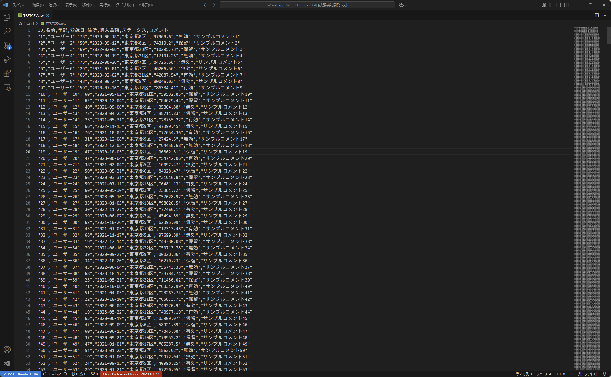

# VSCode csv viewer

This is the README for your extension "csv-view-and-export". After writing up a brief description, we recommend including the following sections.

## Features

* CSVファイルをテーブル形式でプレビューします
* エディタのスクロール、カーソル移動に追従して、プレビュー画面も更新されます
* エディタのカーソル位置を、プレビュー画面でハイライト表示します

## Instration

1. VSCode を開く。
2. 拡張機能 (Ctrl+Shift+X) を開く。
3. "csv-viewer" を検索。
4. "インストール" ボタンをクリック。

## Usage

1. VSCode で CSV ファイルを開く。
2. CTRL + SHIFT + p で "csv-viewer.showSpreadSheet" を入力する
3. 「Do you want to use the first row as the title?」（先頭行をタイトルとして常に表示するか）と確認されるので、Y か N を選択する
4. Enter を押すと現在の CSV ファイルの右側に新しいタブが表示され、CSVファイルの内容が表として表示される

## Requirement

* Visual Studio Code バージョン 1.96 以上

## Known Issues

* とくになし

## Contribution

[https://github.com/irukasano/vscode-csv-viewer](https://github.com/irukasano/vscode-csv-viewer)

## Release Notes

### 1.0.0

このバージョンです。初回リリース。

**Enjoy!**
